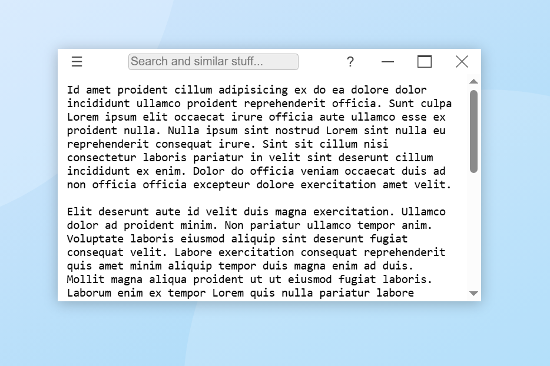

# desktop-window

A lightweight Web Components-based custom element that replicates the look and feel of native desktop application windows — resizable, movable, and styled like a traditional OS window. No frameworks required.



## NOT READY FOR PRODUCTION

This package is in active development, and not yet reached the point where I can recommend using in production environment.

- Its tested to some degree, but not well tested or battle proven.
- Expect some API and behaviour changes.

### Roadmap

- comprehensive documentation
- a lot of examples incl. integration with a desktop environment
- accessibility
- test cases / unit tests?

## Usage

```
import { register, DesktopWindow } from 'desktop-window';

register(); // this guards against multiple accidental registration

// OR you could just do this instead:
customElements.define('desktop-window', DesktopWindow);
```

Or without a build tool:

Manually copy the `desktop-window.autoload.js` to your site, then:

```html
<script src="desktop-window.autload.js"></script>
```

Use the `<desktop-window>` tag in HTML code.

```html
<style>
  desktop-window[fullscreen] #enter-fullscreen { display: none; }
  desktop-window:not([fullscreen]) #exit-fullscreen { display: none; }
</style>
<div style="position: relative; width: 100vw; height: 100vh;">
  <desktop-window name="Hello world!" movable resizable minimizable maximizable closable centered>
    The contents of the window are placed here.
    <button id="enter-fullscreen">⛶ Enter fullscreen</button>
    <button id="exit-fullscreen">⛶ Exit fullscreen</button>
  </desktop-window>
</div>
<script>
document.getElementById('enter-fullscreen').addEventListener('click', function (event) {
    this.dispatchEvent(new Event('request-fullscreen', { bubbles: true }));
});
document.getElementById('exit-fullscreen').addEventListener('click', function (event) {
    this.dispatchEvent(new Event('exit-fullscreen', { bubbles: true }));
});
</script>
```

## Documentation

### Attributes

- `name`
- `movable`
- `x`
- `y`
- `centered`
- `resizable`
- `width`
- `height`
- `minWidth`
- `maxWidth`
- `minHeight`
- `maxHeigh`
- `minimizable`
- `minimized`
- `maximizable`
- `maximized`
- `closable`
- `fullscreen`
- `hidden`
- `autofocus`
- `frameless`
- `modal`
- `aspectRatio`
- `aspectRatioExtraWidth`
- `aspectRatioExtraHeight`

### Events emitted

- `'closing'`
- `'closed'`
- `'minimizing'`
- `'minimized'`
- `'maximizing'`
- `'maximized'`
- `'restoring'`
- `'restored'`
- `'requesting-fullscreen'`
- `'exiting-fullscreen'`

### Events listening for

- `'close'`
- `'minimize'`
- `'maximize'`
- `'restore'`
- `'request-fullscreen'`
- `'exit-fullscreen'`
- `'move'`
- `'resize-n'`
- `'resize-e'`
- `'resize-s'`
- `'resize-w'`
- `'resize-ne'`
- `'resize-nw'`
- `'resize-se'`
- `'resize-sw'`

### Properties

- `name`
- `movable`
- `x`
- `y`
- `centered`
- `width`
- `height`
- `minWidth`
- `minHeight`
- `maxWidth`
- `maxHeight`
- `resizable`
- `minimizable`
- `minimized`
- `maximizable`
- `maximized`
- `closable`
- `fullscreen`
- `hidden`
- `autofocus`
- `frameless`
- `modal`
- `aspectRatio`
- `aspectRatioExtraWidth`
- `aspectRatioExtraHeight`

### Methods

- `flash()`
- `isFocused()`
- `focus()`
- `blur()`
- `close()`
- `destroy()`
- `getPosition()`
- `setPosition(x, y)`
- `getSize()`
- `setSize(width, height)`
- `getNormalBounds()`
- `getBounds()`
- `setBounds({ x, y, width, height })`
- `getContentSize()`
- `setContentSize(width, height)`
- `getContentBounds()`
- `setContentBounds({ x, y, width, height })`
- `setAspectRatio(ratio, { width, height })`

### Slots

- `titlebar-start`
- `titlebar-center`
- `titlebar-end`

### Parts

- `window`
- `titlebar`
- `titlebar-start`
- `titlebar-center`
- `titlebar-end`
- `titlebar-text`
- `minimize-button`
- `restore-button`
- `maximize-button`
- `close-button`
- `client-area`

### CSS Variables

- `--desktop-window-background-color`
- `--desktop-window-border-width`
- `--desktop-window-border-color`
- `--desktop-window-minimize-duration`
- `--desktop-window-maximize-duration`
- `--desktop-window-titlebar-height`
- `--desktop-window-titlebar-text-color`
- `--desktop-window-titlebar-background-color`
- `--desktop-window-titlebar-font-family`
- `--desktop-window-titlebar-font-size`
- `--desktop-window-minimize-button-mask-image`
- `--desktop-window-maximize-button-mask-image`
- `--desktop-window-restore-button-mask-image`
- `--desktop-window-close-button-mask-image`
- `--desktop-window-buttons-width`
- `--desktop-window-buttons-height`
- `--desktop-window-buttons-margin`
- `--desktop-window-buttons-text-color`
- `--desktop-window-buttons-background-color`
- `--desktop-window-buttons-hover-text-color`
- `--desktop-window-buttons-hover-background-color`
- `--desktop-window-minimize-text-color`
- `--desktop-window-minimize-background-color`
- `--desktop-window-minimize-hover-text-color`
- `--desktop-window-minimize-hover-background-color`
- `--desktop-window-maximize-text-color`
- `--desktop-window-maximize-background-color`
- `--desktop-window-maximize-hover-text-color`
- `--desktop-window-maximize-hover-background-color`
- `--desktop-window-restore-text-color`
- `--desktop-window-restore-background-color`
- `--desktop-window-restore-hover-text-color`
- `--desktop-window-restore-hover-background-color`
- `--desktop-window-close-text-color`
- `--desktop-window-close-background-color`
- `--desktop-window-close-hover-text-color`
- `--desktop-window-close-hover-background-color`
- `--desktop-window-focused-background-color`
- `--desktop-window-focused-border-color`
- `--desktop-window-focused-titlebar-text-color`
- `--desktop-window-focused-titlebar-background-color`
- `--desktop-window-focused-buttons-text-color`
- `--desktop-window-focused-buttons-background-color`
- `--desktop-window-focused-buttons-hover-text-color`
- `--desktop-window-focused-buttons-hover-background-color`
- `--desktop-window-focused-minimize-text-color`
- `--desktop-window-focused-minimize-background-color`
- `--desktop-window-focused-minimize-hover-text-color`
- `--desktop-window-focused-minimize-hover-background-color`
- `--desktop-window-focused-maximize-text-color`
- `--desktop-window-focused-maximize-background-color`
- `--desktop-window-focused-maximize-hover-text-color`
- `--desktop-window-focused-maximize-hover-background-color`
- `--desktop-window-focused-restore-text-color`
- `--desktop-window-focused-restore-background-color`
- `--desktop-window-focused-restore-hover-text-color`
- `--desktop-window-focused-restore-hover-background-color`
- `--desktop-window-focused-close-text-color`
- `--desktop-window-focused-close-background-color`
- `--desktop-window-focused-close-hover-text-color`
- `--desktop-window-focused-close-hover-background-color`

## Notes

- Always set `position: relative` or `position: absolute` on the **immediate parent container**, or the window may behave unexpectedly. Only exception is when the parent is `document.body`.

- Setting `overflow: hidden` on the container element is recommended to hide windows moved partially outside of the area and prevent an appearing scrollbar.

- The window works only when there is a valid `parentElement`, so appending eg. to a shadow root directly will not work.

- Appending to the `document.body` works, but don't forget to set the body height or have content that stretches the area!

- When the script is asynchronously loaded and the HTML has windows, I recommend you this CSS to prevent jumping content:
  ```css
  desktop-window:not(:defined) { display: none; }
  /* OR for a more general solution */
  *:not(:defined) { display: none; }
  ```

## Missing a feature?
Create an issue describing your needs!
If it fits the scope of the project I will implement it.
